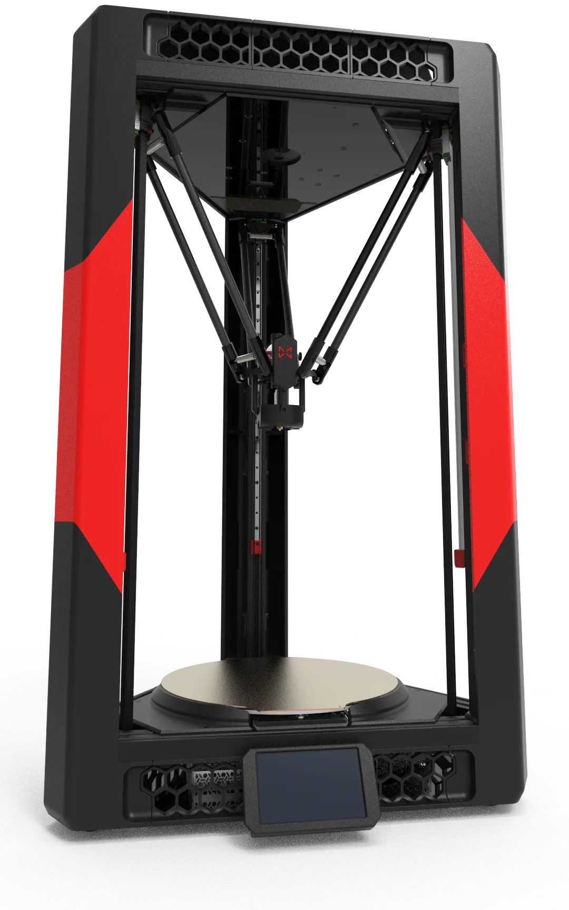
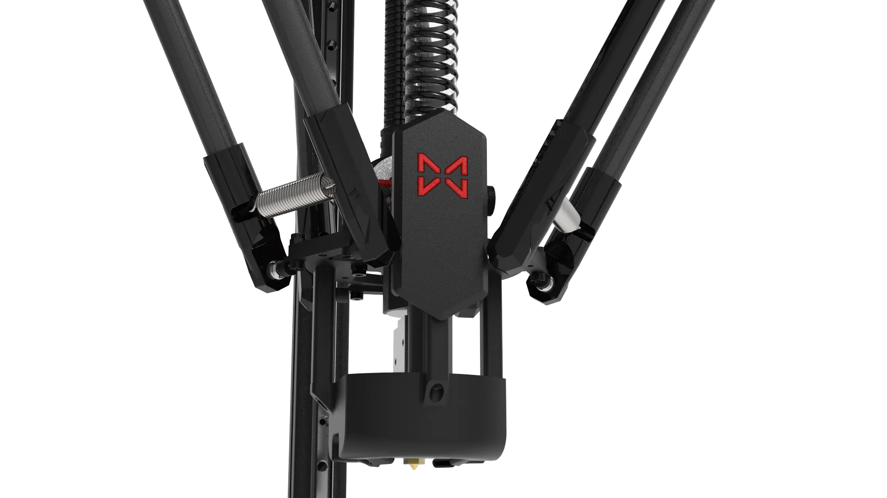
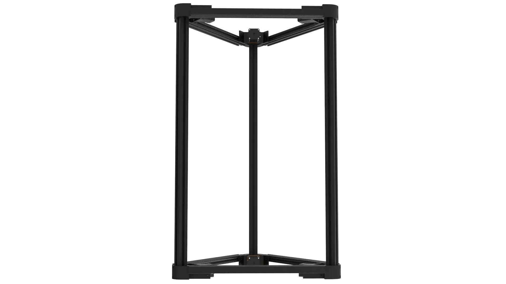
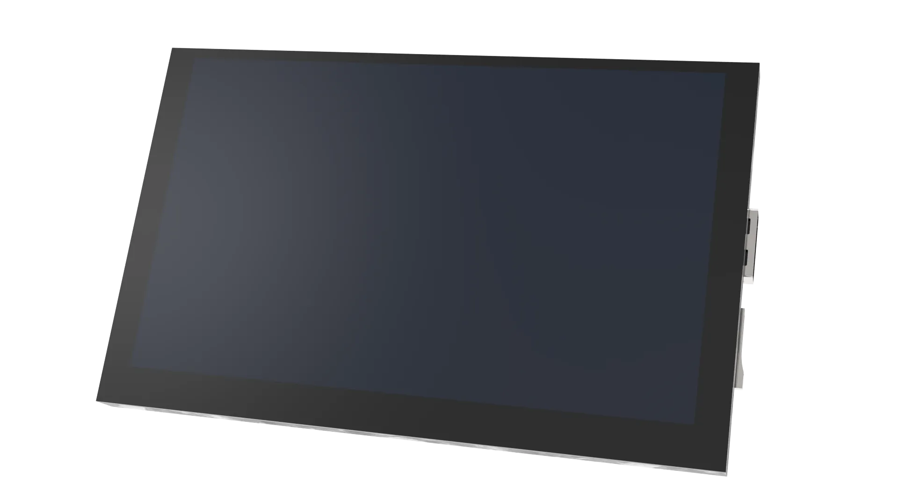
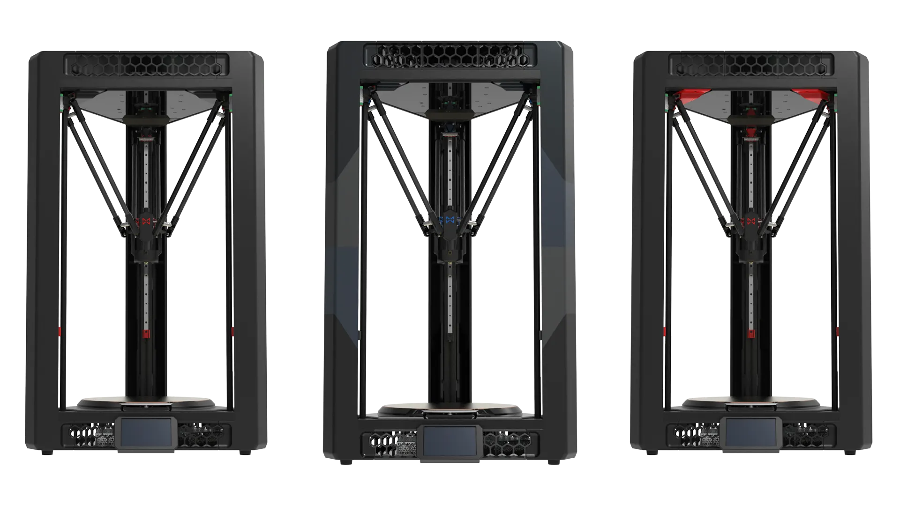
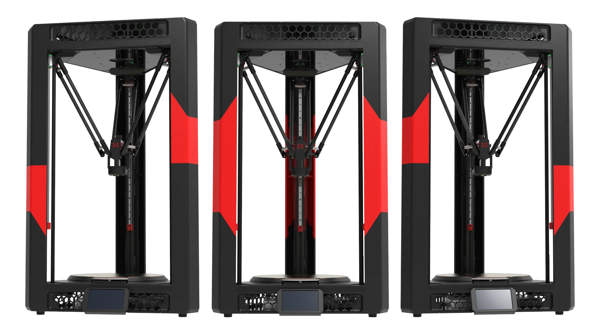

## What is Venture Delta?

<strong>Venture Delta</strong> is a medium-sized high-speed 3D printer kit with a cylindrical printing area (Ø300 × 330mm) and Delta kinematics. It is a hybrid product that draws inspiration from teams and communities including, but not limited to, [Doron-Velta], [VoronDesign](https://github.com/VoronDesign), [Kossel](https://github.com/jcrocholl/kossel), and [Annex Engineering](https://github.com/Annex-Engineering). It was originally created to build a [Voron-style](https://www.youtube.com/watch?v=nhRFD6ivOdY) Delta structure 3D printer as a branch of [Doron-Velta] and has been authorized by its author [Rogerlz](https://github.com/rogerlz).
[Doron-Velta]:https://github.com/rogerlz/Doron-Velta
{.img1}

Adhering to the design philosophy of <strong>durability</strong>, its key components use high-precision CNC machined parts, 9MM wide belts and 6AWD all-wheel drive, a high-rigidity structure composed of 3030 and 2040 high-quality aluminium profiles, a precision motion control system, an optimised CPAP remote air supply and heat dissipation, and a metal lightweight transmission module. This makes it not only fast in printing and large in build size, but also has excellent stability and reliability. Moreover, relying on the open ecosystem and the universal replaceability of hardware, its own maintenance requirements are extremely low and the replacement cost is extremely low.
{.img1}

This is a typical Delta kinematics 3D printer. The triangular frame is more stable than a square frame, and because all three corners are identical, it significantly reduces assembly difficulty. If you are a seasoned Voron 3D printer enthusiast, you will experience unprecedented assembly comfort. Compared to other 3D printer structures, all movement is generated by the simultaneous movement of three motors, giving it an inherent advantage in speed (Corexy structures use two motors simultaneously, and Cartesian structures use one motor to drive one axis). The fixed platform design and high-precision photoelectric sensors allow you to print directly without recalibrating after initial calibration, saving printing time. Finally, its movement is elegant and stress-relieving; appreciating the printing process of this beautiful Delta kinematics 3D printer will release stress and bring comfort.
{.img1}

Equipped with a 550MHz H723 single-chip microcomputer, and featuring a specially designed quad-core A53 industrial-grade processor, 512MB DDR4 memory (equipped with a memory expansion port) + 16GB solid-state storage, and a 5-inch high-definition capacitive touchscreen, it requires only a single connection cable for communication and power supply. This not only delivers an extremely fast assembly and printing experience but also ensures a comfortable operating experience.
{.img1}

All non-structural parts are designed for 3D printing and can be printed by the machine itself. It is compatible with and adaptable to a variety of expansion modules and printing components. With the support of an open ecosystem and community, it can be an infinitely evolving Delta kinematic 3D printer that does not require repeated purchases. You can build it into a unique 3D printer that is just for you.
{.img1}

This design also includes provisions for encapsulation ( enclosure ) expansion, allowing for future encapsulation upgrades without affecting the print area. It provides ample room for future expansion and offers extensive upgrade and modification possibilities, making it highly customisable. Whether you're seeking higher performance or a more personalised customisation, you'll find satisfaction here.

## Build your Venture Delta!

With the <strong>Venture Delta DIY kit</strong>, you'll have the opportunity to assemble a powerful Delta kinematics high-speed 3D printer yourself!

This is a fun-filled weekend building experience (with kids), complete with friendly and beautifully designed [instructions for beginners](../1/1).

Choose this kit to start your 3D printing journey and follow in the footsteps of many enthusiasts to gain a comprehensive understanding of the internal workings of the Delta kinematics 3D printer.

Whether you're new to 3D printing or a seasoned expert, Venture Delta meets all your needs for a high-speed, reliable, and versatile machine.
    {.img1}
