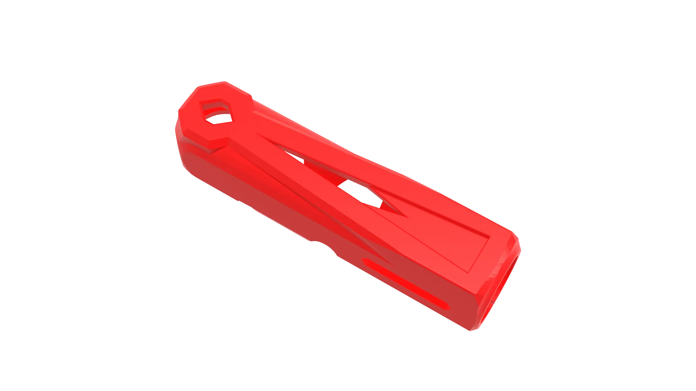

## 0.Precautions

!!! warning "warning"
    When fastening the printed parts with screws, do not tighten them too much to avoid damaging the printed parts.
    
    Screws that need to be coated with threadlocker(Voron recommend Blue thread locke), will show in <strong>Blue</strong>：
    {.img1}
    
!!! info "info"
    Printed parts throughout this section make use of threaded inserts, these need to be pressed into the printed part with a soldering iron:
    {.img1}

???+ tip "tip"
    When securing the self-locking nut, it is recommended to use a wrench for assistance:
    {.img1}
    For unthreaded printed parts, using a power tool will make installation easier:
    {.img1}

## 1.Hot-end assembly

### Required materials

1.Metal hanging platform (Effector) * 1
   {.img1}

2.Metal ball joint connector * 3
   {.img1}

3.Printhead assembly * 1
   {.img1}

4.PTFE tubing * 1
   {.img1}

5.M2.5*6 cap head screws * 4
   {.img1}

6.M3*10 cap head screws * 6
   {.img1}

7.Self-locking nuts * 6
   {.img1}

### Assembly process

1.Insert two M3*10 cap-head screws into the metal ball joint connector, as shown in the figure.
   {.img1}

2.Apply thread-locking adhesive to the M3*10 cap-head screws. Insert them into the metal mounting bracket, and tighten using two self-locking nuts.
   {.img1}
   {.img1}

3.Please ensure it is tightened securely. A wrench can be used for additional tightening.
   {.img1}
   {.img1}

4.The installation methods for the other two groups are the same.
   {.img1}

5.Apply thread-locking adhesive to the four M2.5*6 cap-head screws.
   {.img1}
   
6.Cut a <strong>14MM</strong> section of PTFE tubing.
   {.img1}

7.Using the short tube as a positioning reference, connect the printhead assembly to the metal platform as shown in the figure.
   {.img1}
   
8.Secure the printhead assembly to the metal mounting platen (Effector) using four M2.5*6 cap-head screws, tightening them securely.
   {.img1}

9.Pass the printhead assembly wires through the metal hanger (Effector), as shown in the diagram.
   {.img1}

## 2.Extruder Assembly

### Required materials

1.Extruder back plate * 1
   {.img1}

2.Extruder motor * 1
   {.img1}

3.POM Gear * 1
   {.img1}

4.Long extruder shaft * 1
   {.img1}

5.Short extruder shaft * 1
   {.img1}

6.Main filament gear * 1
   {.img1}

7.Grub screw * 1
   {.img1}

8.Idler filament gear * 1
   {.img1}

9.Spring * 1
    {.img1}

10.Gasket * 1
    {.img1}

11.Tension Thumb screw * 1
    {.img1}

12.MR85 bearings * 2
    {.img1}

13.Needle bearings * 2
    {.img1}

14.Nylon isolation columns * 4
    {.img1}

15.Self-locking nuts * 6
    {.img1}

16.Heat inserts * 1
   {.img1}

17.M3*14 cap Head Screws * 2
    {.img1}

18.M3*20 cap Head Screws * 2
    {.img1}

19.M3*35 round head screws * 2
    {.img1}

### Printed parts

1.[Extruder body] * 1
[Extruder body]: dy1.stl
   {.img1}

2.[Extruder idler] * 1
[Extruder idler]: dy2.stl
   {.img1}

3.[CPAP pipe mount] * 1
[CPAP pipe mount]: dy3.stl
   {.img1}

### Assembly process

1.Press the MR85 bearing into the extruder back plate, as shown in the figure.
   {.img1}
   {.img1}

2.Insert the main filament gear onto the POM gear shaft, paying attention to the direction of the main filament gear's opening, as shown in the figure.
   {.img1}
   {.img1}

3.After applying threadlocker to the grub screw, tighten it, the set screw should be touching the flat side of the POM gear shaft, as shown in the figure.
   {.img1}
   {.img1}
   {.img1}

4.Insert the MR85 bearing onto the POM gear shaft, as shown in the figure.
   {.img1}

5.Use a soldering iron to press the heat insert into the extruder body, as shown in the picture.
   {.img1}
   {.img1}

6.Connect the POM gear to the extruder body. The MR85 bearing should be secured in the slot of the extruder body, as shown in the figure.
   {.img1}
   {.img1}

7.Connect the POM gear to the extruder back plate, the POM gear should be inserted into the MR85 bearing of the extruder back plate, as shown in the figure.
   {.img1}
   {.img1}

8.Insert two nylon spacer posts into the two holes below the extruder back plate and the extruder body. Pass two M3 *20 cap-head screws through them and tighten the self-locking nuts, as shown in the picture.
   {.img1}
   {.img1}
   {.img1}
   {.img1}

9.Insert two nylon spacers into the two holes above the extruder back plate and the extruder body. Use two M3 *35 cap-head screws to pass them through and screw them onto the extruder motor. Pass them through the CPAP pipe mount and tighten the self-locking nuts, as shown in the figure.
   {.img1}
   {.img1}
   {.img1}
   {.img1}
   {.img1}
   {.img1}

10.Put a small amount of lubricant on the 2 needle bearings. Then insert the two needle roller bearings onto the short extruder shaft. Insert them into the Extruder idler gear and press them into the extruder idler part, as shown in the figure. 

!!! warning "warning"
    Note the direction in which the extruder idler gear is pressed in.
   {.img1}
   {.img1}
   {.img1}
   {.img1}
   {.img1}
   {.img1}

!!! info "info"
    It swould be recomended to lubricate the bearings with tiny amount a ptfe grease, as well as where the teeth meet the main filament gear.

11.Connect the long extruder shaft through the extruder body part and the extruder idler part, as shown in the figure.
   {.img1}
   {.img1}

!!! info "Pressing the extruder shaft"
       If the long extruder shaft is difficult to press in, a power tool can be used to clamp the long extruder shaft to enlarge the hole in the extruder print. 

       Do not press it in forcefully to avoid damaging the extruder print.

12.Pass two M3*14 cap head screws through the extruder, and connect it to the metal mounting platform ( effector ) Then tighten two self-locking nuts, as shown in the figure.
   {.img1}
   {.img1}
   {.img1}

13.Insert the tension thumb screw through the spring and washer, and screw it onto the heat insert  of the extruder body, as shown in the figure.
   {.img1}
   {.img1}
   {.img1}
   {.img1}

## 3.Duct assembly

### Required materials

1.M2.5*6 cap head screws * 3
   {.img1}

2.M3*10 cap head screws * 3
   {.img1}
   
3.M3*14 cap head screws * 2
   {.img1}

### Printed parts

1.[Air duct guide]  * 1
[Air duct guide]: dy4.stl
   {.img1}

2.[Duct connector] * 1
[Duct connector]: dy5.stl
   {.img1}

3.[Air duct fixing column] * 2
[Air duct fixing column]: dy6.stl
   {.img1}

4.[Air-blocking ring] * 1
[Air-blocking ring]: dy7.stl
   {.img1}

5.[Air duct] * 1
[Air duct]: dy8.stl
   {.img1}

6.[Decorative front] * 1
[Decorative front]: dy9.stl
   {.img1}

7.[Logo] * 1
[Logo]: dy10.stl
   {.img1}
   
### Assembly process

1.Secure the air duct connector to the heatsink and use M3 *10 cap-head screws through the metal mounting bracket for fixation, as shown in the picture.
   {.img1}
   {.img1}
   {.img1}

2.Press the logo into the decorative front piece, as shown in the figure.
   {.img1}
   {.img1}
   {.img1}

3.Place the air duct guide below the decorative front and thread it through with two M3 * 14 cap-head screws, as shown in the picture.
   {.img1}
   {.img1}
   {.img1}
   {.img1}

4.Pass the two M3*14 cap-head screws through the metal mounting bracket and connect them to the duct connector, tighten the screws as shown in the picture.
   {.img1}
   {.img1}
   {.img1}

5.Pass the M3*14 cap-head screw through the metal mounting bracket ( effector ), and connect it to the duct fixing column, tighten the screw as shown in the picture.
   {.img1}
   {.img1}

!!! info "Air duct fastener"
       Note the orientation of the air duct fixing column; the larger holes are secured with M3*14 cap-head screws.
       {.img1}

6.Insert the air-blocking ring into the ductwork component and connect it to the ductwork connector, as shown in the figure.
   {.img1}
   {.img1}
   {.img1}
   {.img1}
   {.img1}

7.Secure with three M2.5*6 cap-head screws, tightening them as shown in the picture.
   {.img1}
   {.img1}
   {.img1}

## 4.Cable arrangement

### Required materials

1.Corrugated pipe * 1
   {.img1}

2.Cable ties * 2
   {.img1}

### Printed parts

1.[Wire threader tool] * 1
[Wire threader tool]: dy11.stl
   {.img1}

### Assembly process

1.Use the wire threader tool to thread the wire into the corrugated pipe starting at the effector, as shown in the picture.
   {.img1}
   {.img1}
   {.img1}

2.Then secure the corrugated pipe with cable ties to CPAP pipe mount. Trim off any excess of the cable ties, as shown in the figure.
   {.img1}
   {.img1}
   {.img1}

## 5.Connecting rod assembly

### Required materials

1.Spoon-shaped connecting rod * 6
   {.img1}

2.Tension springs * 6
   {.img1}

### Assembly process

1.Apply lubricant to each spoon-shaped connecting rod and its corresponding spoon-shaped hole to ensure smooth movement during operation, as shown in the figure.
   {.img1}

2.Connect the two spoon-shaped rods using two tension springs, as shown in the figure.
   {.img1}

3.Pull the tension spring to engage the two spoon-shaped connecting rods as shown in the diagram.
   {.img1}
   {.img1}

4.The other two sets of connections are the same, as shown in the figure.
   {.img1}
   
!!! warning "warning"
    Please apply grease to the spoon-shaped hole of each spoon-shaped connecting rod. This is the key to ensuring smooth movement. The grease is usually a white paste, and Vaseline can be used as an alternative.

!!! note "Additional decorative parts"
    These are specially designed connecting rod decorative parts. You can print them in different colors according to your preference to change the appearance color of the spoon-shaped connecting rod. Normally 12 pieces are required, but you can also print just a few as embellishments. They can be directly fitted on without disassembling your spoon-shaped connecting rod.
    #### [Connecting rod parts]
    [Connecting rod parts]: dy13.stl
      {.img1}
      
## 6.Pipeline connection

### Required materials

1.PTFE tubing * 1
   {.img1}

### Printed parts

1.[Pipe clips] * 4
[Pipe clips]: dy12.stl
   {.img1}

### Assembly process

1.Install the CPAP supply duct onto the duct guide as shown in the figure.
   {.img1}
   {.img1}
   {.img1}

2.Cut a <strong>20MM</strong> section of PTFE tubing.
   {.img1}

!!! info "PTFE tube length"
    There is no strict limit to the length of the PTFE tube here, <strong>20MM</strong> or more is also acceptable.

3.Insert the short tube into the extruder printout to prevent the filament from damaging the printed part, as shown in the figure.
   {.img1}
   {.img1}
   {.img1}

4.Insert the corrugated pipe into the small hole in the base plate connector, as shown in the figure.
   {.img1}
   {.img1}

5.Use pipe clips to secure the CPAP supply duct to the corrugated pipe, as shown in the figure.
   {.img1}
   {.img1}

!!! info "Pipe clips"
    Generally, three to four pipe clips are sufficient for aesthetic purposes.

{.img1}

???- question "FAQ"

    **Q: Why is the extruder designed this way?**

    **A:** The use of metal backplate and motor fixed play a certain role in heat dissipation, and the middle is used to isolate the heat, and the extruder adopts integrated printing, removing the original copper nuts and screws, reducing the difficulty of assembly and improving the assembly accuracy (because there is no need for assembly), and thanks to the advantages of 3D printing to make modification and replacement easier.

    **Q: Can I use other metal extruders?**

    **A:** Yes, the hole position uses the standard Sherpa Mini extruder hole position, and you can use the all-metal Sherpa Mini, Sherpa micro, Lgx-lite and other extruders.

    **Q: Does Super Volcano work poorly?**

    **A:** I modified the design of the Super Volcano, changing the brass block to a lighter aluminum material, and the hose used TC4's titanium alloy throat and thickened it to make it stronger, using the standard V6 hose length, reducing the height of the heat sink, the long-term test effect is not very bad, and at the same time, because the nozzle is cheaper, it is more suitable for long-term use.

    **Q: Can I replace other heating blocks?**

    **A:** Yes, with the standard E3DV6 hose, the E3D V6, E3D Volcano and E3D compatible ring heating blocks can be replaced, so that you can choose from a wider variety of nozzles, and you can use CHT nozzles after replacement.

    **Q: Can I replace the whole replacement?**

    **A:** Yes, the mounting holes are compatible with Voron V6 and a large number of Voron-compatible printheads can be used.

    **Q: Can the air duct parts be replaced?**

    **A:** Yes, I used the air guide design challenge hole position of the Youtube NeedItMakeIt, so all the air guide models posted and shared in this competition are compatible.

    **Q: Can I install a separate cooling fan?**

    **A:** Yes, I have reserved holes, you can add an independent hose cooling fan, the original design is already there, but I solved the problem of a single fan, for higher printing speed, I abandoned the throat cooling fan.
