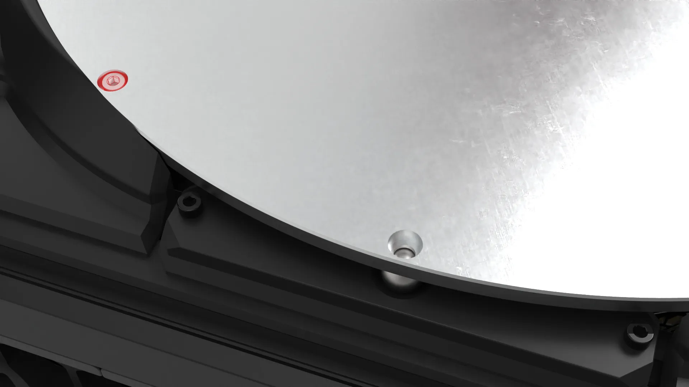

## 0. Precautions

!!! warning "Screw fastening"
    When fastening the printed parts with screws, do not tighten them too much to avoid damaging the printed parts.

## 1. Heated bed support

### Required materials

1.Heated bed aluminum plate * 1
   {.img1}

2.M3*14 cap head screws * 6
   {.img1}

3.T-Nut type 20 - M3 * 6
   {.img1}

4.M4*8 button head screws * 3
   {.img1}

5.Threaded steel ball M4 * 3
   {.img1}

### Printed parts

1.[Heated bed mount] * 3
[Heated bed mount]: dy1.stl
   {.img1}

### Assembly process

1. Pass the M4*8 round head screw through the heated bed mount and screw it into the threaded steel ball，tighten as shown in the figure.
   {.img1}
   {.img1}
   {.img1}

2. Use two M3*14 cap-head screws to pass through the heated bed mount and screw on two t-nuts, type 20-M3, do not tighten them completely, just tighten them, as shown in the picture.
   {.img1}
   {.img1}

3. Secure to the short aluminum profile, note the position of the two t-nuts, type 20-M3. They should be engaged in the grooves of the short profile, but do not tighten them completely, as shown in the picture.
   {.img1}
   {.img1}

4. Adjust the position of the heated bed mount, so that the edge of the short aluminum profile is an equal distant from both sides of the heated bed mount, as shown in the figure.
   {.img1}

5. The installation methods for the other two groups are the same.
   {.img1}
   
6. Place the heated bed aluminum plate onto the heated bed mounts, as shown in the figure.
   {.img1}
   {.img1}
   

!!! info "Heated bed aluminum plate"
     Note the front and back of the heated bed aluminum plate ; the counterbore hole should face upwards.
    {.img1}

7. Fine-tune the position of the heated bed aluminum plate and the heated bed mounts so that all three holes in the heated bed aluminum plate can fit into the threaded steel ball heads of the heated bed mounts. 

!!! warning "warning"
     After ensuring that all three holes in the heated bed aluminum plate can fit into the blind ball heads on the heated bed mounts.

     measure and fine-tune the distance between the edge of the short aluminum profile and the two sides of the heated bed mounts to make them basically consistent. 

     Then, tighten all the M3*14 cap head screws on the heated bed mount securing the profiles.

     Do not overtighten to avoid damaging the printed parts, as shown in the figure.

   {.img1}
   
!!! info "Embedded nut" 
    After tightening, check the heated bed aluminum plate to ensure that the heated bed aluminum plate and the threaded steel ball head of the heated bed mount are tightly fitted without gaps, and that there will be no shaking or unevenness. If there is any, loosen the screw and readjust.

    You can observe the position of the drop-in t-nut, type 20-M3 by looking at both sides of the short aluminum profile to ensure that the screws on both sides are engaged in the grooves of the short profile and have been tightened.

    {.img1}

## 2.Side baffles

### Required materials

1.M3*8 countersunk screws * 4
   {.img1}

2.T-Nut type 20 - M3 * 4
   {.img1}

### Printed parts

1.[Heated bed baffles] * 2
[Heated bed baffles]: dy2.stl
   {.img1}

### Assembly process

1. Use two M3*8 countersunk screws to pass through the heated bed baffle, and screw on two type 20 - M3 t-nuts, do not tighten them completely. Just tighten them, as shown in the picture .
   {.img1}
   {.img1}

2. Secure the heated bed baffles to the short aluminum profile. 

-   :material-clock-fast:{ .lg .middle } __Tips__

    ---

    <ul>
      <li>Pay attention to the position of the two drop-in t-nuts (Type 20 - M3), they should be properly engaged in the grooves of the short profile and tightened. </li>
      <li>Do not overtighten to avoid damaging the printed part, as shown in the picture.</li>
  {.img1}

3.The installation method is the same on the other sides.
   {.img1}

## 3.Rear side panel

### Required materials

1.M3*8 countersunk screws * 2
   {.img1}

2.T-Nut type 20 - M3 * 2
   {.img1}

### Printed parts

1.[Rear Heated Bed Baffle] * 1
[Rear Heated Bed Baffle]: dy3.stl
   {.img1}

### Assembly process

1. Pass two M3*8 countersunk screws through the rear heated bed baffle and screw on two drop-in type20 - M3 boat nuts, but do not tighten them completely. Just tighten them as shown in the picture.
   {.img1}
   {.img1}

2. Secure the rear heated bed baflle to the short aluminum profile. 

-   :material-clock-fast:{ .lg .middle } __Tips__

    ---

    <ul>
      <li>Pay attention to the position of the two drop-in t-nuts (Type 20 - M3), they should be properly engaged in the grooves of the short profile and tightened. </li>
      <li>Do not overtighten to avoid damaging the printed part, as shown in the picture.</li>
  {.img1}

   

## 4.Heated bed assembly

### Required materials

1.PEI build surface * 1
   {.img1}

2.Magnetic sticker * 1
   {.img1}

3.Mains powered silicone heating pad *1
   {.img1}

4.Heated Bed thermal cut off fuse * 1
   {.img1}

5.Fuse connection cable * 1
   {.img1}

6.M3*10 cap head screw * 1
   {.img1}

7.Self-locking nut * 1
   {.img1}

### Assembly process

1. Use an M3*10 cap-head screw to pass through the heated bed aluminum plate and the heated bed thermal fuse, and tighten it with a self-locking nut, as shown in the figure. 
   {.img1}

!!! Warning "Screw Fixing"
    Note the orientation of the M3*10 cap-head screws when installing the heated bed aluminum plate. The counterbore hole should face upwards.
    {.img1}

2. Connect the thermal fuse cable as shown in the figure.
   {.img1}

3. Attach the mains powered silicone heater pad to the heated bed aluminum plate, ensuring that it is centered on the plate and the cable exit point is close to the heated bed thermal fuse, as shown in the figure.
   {.img1}
   {.img1}

4. Connect the thermal fuse cable of the silicone heating pad to the fuse cable of the heated bed, as shown in the figure. 
   {.img1}
   {.img1}

5. Reverse the heated aluminum bed plate and attach the magnetic sticker to it, as shown in the picture.
   {.img1}
   {.img1}

6. Mount the PEI build sheet onto the heated aluminum plate as shown in the figure
   {.img1}
   {.img1}

???- question "FAQ"

    **Q: Why are ball joints used to secure the heated bed instead of screws?**

    **A:** When screws are fixed and heated, they affect the flatness of the heated bed. Heating can cause the aluminum plate to deform due to heat. Using screws to fix the screws prevents the thermal stress from extending normally. The higher the temperature, the more screws there are, and the denser the arrangement, as such the greater the stress.

    **Q: What are the advantages of this design?**

    **A:** Three points define a plane. No matter how the aluminum plate expands or deforms, the three points ensure a stable plane. At the same time, it is convenient for maintenance. The heated bed can be placed in the rear slot at any time to clean and modify the bottom electrical compartment.

    **Q: Why not put insulation cotton on a heated bed?**

    **A:** The purpose of insulation cotton is to prevent heat loss. It is often used in DC heated beds. Due to power limitations, the heating rate is slow and insulation is required. AC heated beds have a faster heating rate and relatively higher power. To improve production efficiency, insulation cotton is not used, and the heated bed can be cooled more quickly, thus improving the efficiency of part removal.

    **Q: can I still add a thermal insulation to the botton of the heated bed plate if I want to?**

    **A:** Yes, but keep in mind that the heated bed will stay hot longer and that you would need to remove the PEI build sheet with the finished print on it to encourage it to release the part quicker.
